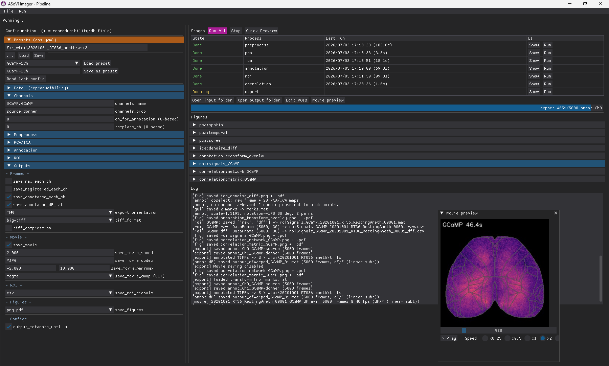
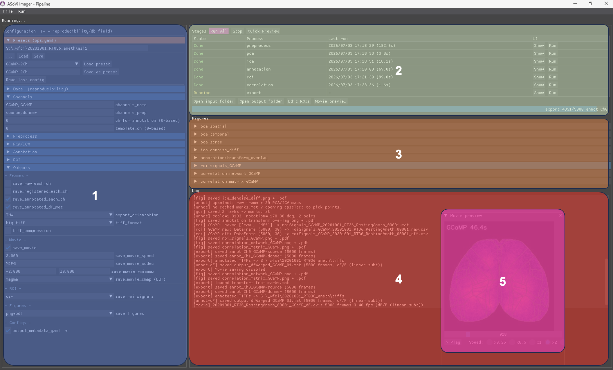

# ASoVi Imager — Getting started



This guide is written for people who have **done little or no programming**. Follow
it in order and you will end up able to

- launch the program,
- load your own recording (or a sample one),
- run the analysis, and
- find the result files.

> **If something goes wrong**, don't start over — go to
> [Chapter 9, Troubleshooting](#chapter-9--troubleshooting).

日本語版: [はじめかた](getting_started_jp.md)

---

## Contents

- [What does this software do?](#what-does-this-software-do)
- [A very short glossary](#a-very-short-glossary)
- [Chapter 0 — Install `uv`](#chapter-0--install-uv)
- [Chapter 1 — Get the program](#chapter-1--get-the-program)
- [Chapter 2 — First-time setup (`uv sync`)](#chapter-2--first-time-setup-uv-sync)
- [Chapter 3 — Launch the GUI](#chapter-3--launch-the-gui)
- [Chapter 4 — Prepare your data](#chapter-4--prepare-your-data)
- [Chapter 5 — Run an analysis](#chapter-5--run-an-analysis)
- [Chapter 6 — Where do the results go?](#chapter-6--where-do-the-results-go)
- [Chapter 7 — Saving and recalling settings](#chapter-7--saving-and-recalling-settings)
- [Chapter 8 — Export to NWB](#chapter-8--export-to-nwb)
- [Chapter 9 — Troubleshooting](#chapter-9--troubleshooting)
- [Appendix A — Command reference](#appendix-a--command-reference)
- [Appendix B — Algorithms and sources](#appendix-b--algorithms-and-sources)

---

## What does this software do?

ASoVi Imager analyses wide-field cortical imaging (WFCI) recordings — the cortex
filmed from above — and runs these steps for you:

1. **Registration** — undoing the small shifts that happen during a recording
2. **dF/F**, the usual proxy for neural activity — by linear subtraction when a
   reference channel is available, against a percentile baseline otherwise
3. **PCA / ICA**, with optional removal of the components you mark as noise
4. **Atlas registration** — aligning your brain to the Allen reference brain
5. **Per-region signal extraction and correlation**
6. **Export** — movies, figures and numeric files

It began as MATLAB code and was ported to Python. **You do not need to understand
the internals**: it is built so that pressing the buttons on screen, in order, is
enough.

---

## A very short glossary

| Term | What it means here |
| --- | --- |
| **Terminal** | The window where you type commands. Called "PowerShell" on Windows, "Terminal" on macOS. |
| **Command** | A line you type into the terminal. One line, then Enter. |
| **`uv`** | The tool that sets everything up for you. It fetches Python itself and every component this software needs. |
| **Python** | The language this software is written in. You never install it yourself — `uv` does. |
| **Folder / directory** | The same thing: a container for files. |
| **GUI** | The window you click in. The main screen of this software. |
| **dF/F** | The relative change in brightness. The usual proxy for neural activity. |
| **Atlas** | A standard brain map, used to compare across animals. |
| **ROI** | Region of interest — a patch of cortex whose pixels are averaged into one signal. |
| **Channel** | One colour of the acquisition. Frames cycle through them in a fixed order. |
| **Channel group** | Every channel sharing a name in `channels_name`. PCA/ICA, dF/F and ROI signals are computed per group. |
| **Stage** | One step of the pipeline. There are seven, and each can be run on its own. |

---

## Chapter 0 — Install `uv`

The only thing you install by hand is **one tool, called `uv`**. Python and
everything else follows automatically.

### 0-1. Open a terminal

**On Windows**

1. Click the **Start** button (the Windows logo)
2. Type `powershell`
3. Click **Windows PowerShell** in the results

**On macOS**

1. Press `command (⌘) + space` to open Spotlight
2. Type `terminal`
3. Click **Terminal** in the results

A window with a text prompt opens. That is where you type.

### 0-2. Install `uv`

Copy the whole line below, paste it into the terminal, and press Enter. (To paste:
right-click or `Ctrl+V` on Windows, `⌘+V` on macOS.)

**Windows — paste into PowerShell**

```powershell
powershell -ExecutionPolicy ByPass -c "irm https://astral.sh/uv/install.ps1 | iex"
```

**macOS — paste into Terminal**

```bash
curl -LsSf https://astral.sh/uv/install.sh | sh
```

Text scrolls past for a while; when you see something like `installed`, it is done.

> **Other ways, if you prefer one**
> - Windows with `winget`: `winget install --id=astral-sh.uv -e`
> - macOS with Homebrew: `brew install uv`

### 0-3. Check that it worked

**Close the terminal and open a new one.** This is necessary: it is how your
computer learns where `uv` now lives.

In the new terminal, type:

```bash
uv --version
```

If you see a version like `uv 0.x.x`, you are done 🎉 (the digits will differ).

If not, see [Chapter 9](#uv-is-not-recognized).

---

## Chapter 1 — Get the program

Next, put a copy of the program on your computer. There are two ways, and **either
one is fine**.

> ⚠️ If this is a private lab repository, you may need access — a GitHub login, or
> an invitation. If it does not work, ask whoever shared it with you.

### Option A — Download a ZIP (simplest)

1. Open the page you were pointed at (GitHub or elsewhere)
2. Click the green **Code** button → **Download ZIP**
3. Right-click the ZIP → **Extract All** (on macOS, just double-click it)
4. Move the resulting folder somewhere memorable — `C:\work\` on Windows, your
   `Documents` folder on macOS

> You are in the right place if the folder contains a file named **`pyproject.toml`**
> and a folder named **`src`**. Throughout this guide, that outermost folder is
> called the **project folder**.

### Option B — Use `git` (easier to update later)

If you already have `git`, this makes future updates simple. For a first time,
Option A is plenty.

```bash
git clone <URL>
```

Replace `<URL>` with the address you were given.

---

## Chapter 2 — First-time setup (`uv sync`)

Now you install everything the software needs, Python included, **in one step**.
You do this once.

### 2-1. Move the terminal into the project folder

A terminal is always "inside" some folder, and you need it inside the **project
folder** — the one holding `pyproject.toml`.

The command is `cd` (change directory). **The easiest trick**: type `cd `, with a
space after it, then

- **drag the folder onto the terminal window and drop it.**

The path fills itself in. Press Enter.

```text
cd  (drag and drop the folder here)  → Enter
```

If it worked, the folder name appears at the start of the prompt.

> Typing it by hand instead:
> - Windows: `cd C:\work\ASoVi_imager`
> - macOS: `cd ~/Documents/ASoVi_imager`

### 2-2. Install the components

Then type:

```bash
uv sync
```

This downloads and installs Python 3.13 and every library the software needs.

> ⏳ **The first run takes a long time** — several minutes to a quarter of an hour,
> depending on your connection. Large components such as `torch` mean **several GB**
> are downloaded and stored. Even when it looks stuck, it is usually still working.

When `uv sync` finishes and the prompt returns, setup is complete.

### 2-3. Updating later

If you used `git` (Option B), fetch the new version and re-sync:

```bash
git pull
uv sync
```

With a ZIP (Option A), download the new ZIP and repeat this chapter. Your settings
and results live with your data, not inside the project folder, so they survive an
update.

---

## Chapter 3 — Launch the GUI

**From inside the project folder** (where Chapter 2 left you), type:

```bash
uv run python -m asvimg.gui
```

After a moment the main window — **ASoVi Imager - Pipeline** — opens.

> 💡 `uv run` means "run this inside the project's own environment". You will always
> start it this way.
>
> 📌 `uv run asovi-gui` is a shorter way to type the same thing: `uv sync` installs
> the project itself, so the `asovi-*` commands exist inside its environment. Keep
> the `uv run` in front — the bare name is not on your PATH.

**To close it**, use the window's × button. You can leave the terminal open — you
will want it next time.

---

## Chapter 4 — Prepare your data

### Supported file formats

The software reads these recordings:

- `.tif` / `.tiff` (including OME-TIFF)
- `.dcimg` (Hamamatsu)
- `.sifx` (Andor spool folders)
- `.nd2` (Nikon NIS-Elements)
- Even/odd `.h5` recording folders (the Ito-lab format)

> 📌 **For `.nd2` files**: one time point holds every channel, so list the colours in
> `channels_name` **in the order they are stored in the ND2 file** — the count must
> be a multiple of the ND2 channel count, or preprocess refuses to start. `fps` is
> the rate of the whole stream, every channel counted together. Z-stacks and
> multi-point (`P`) files are not read.

### How to arrange the files

**Put all the files from one recording session into a single folder.** That folder —
the **input folder**, `input_dir` — is what you select on screen.

If the folder happens to contain two different formats, preprocess stops rather than
guess; set **`input_format`** in the Data section explicitly to say which one to read.

### Start with something small

> ⚠️ **Sample data such as `Analysis/_sampleData01` is not part of the
> distribution.** Recordings are large and are kept separately from the program. If
> you need practice data, ask whoever shared the software with you.

When trying your own data, pick a **short recording**. If all you have is long ones,
set **`max_frames`** under **Preprocess › 4. General** to something like `500`: the
pipeline then runs end to end on the first 500 frames only, which is enough to
confirm everything works.

---

## Chapter 5 — Run an analysis

### 5-1. Reading the screen



The GUI has **four areas, plus a separate Movie Preview window** (the numbers match the figure).

**1: Configuration** — every analysis parameter, in collapsible sections.

- **Presets**: load a set of settings you or the lab saved earlier
- **Data**: input folder, output format and so on (these are the `db.yaml` fields).
  Two buttons sit at the bottom of the section:
  - **Make export dir** — create the output folder (`output_dir`; when left empty it
    is `<input_dir>/asi/<format>`) and write `db.yaml` / `ops.yaml` into it now,
    without running anything. Useful when you want to fix the settings first
  - **sifx converter** — pick a folder of Andor `.sifx` spools and merge every frame
    into a single BigTIFF
- **Channels**: the order of the colours (channels), the probe names, and so on.
  The assumed design is that the excitation light / probe switches frame by frame
- **Preprocess**: registration and dF/F parameters. The **5. TIFF output** group at
  the bottom — per-channel TIFF writing (`save_raw_each_ch` /
  `save_registered_each_ch`) with `tiff_format` / `tiff_compression` — **also
  appears under Outputs**. It is one setting shown twice: change it in either place
  and both move. Preprocess, not export, is what writes those TIFFs
- **PCA / ICA**: component counts and exclusions (used for denoising and for the
  Allen CCF mapping)
- **Annotation**: atlas registration — which atlas, and how landmarks are chosen
- **ROI**: the ROIs signals are extracted from, and the region-to-region correlation
  (custom ROIs are made with **Edit ROIs** under Stages)
- **Outputs**: **what gets written to disk**, on or off, under the subheadings
  **Frames / Movie / ROI / Figures / Configs**. Movies (`save_movie`), saved
  figures (`save_figures`), atlas-warped dF/F (`save_annotated_dF_mat`) and ROI
  signal CSVs (`save_roi_signals`) are all here

**2: Stages** — where you run the analysis and watch its progress.

- **Run All / Stop** — run all seven stages (see 5-4) in order, or interrupt them
- **Quick Preview** — show the first few frames of the **first** file (see 5-3)
- **Quick Preview (All)** — show the first frames of **every** file, one row per
  file (see 5-3)
- The stage table: each stage's **State**, **Last run** (when it last finished),
  **Show** (re-read the figures it saved last time from disk and display them — this
  does **not** re-run anything) and **Run** (run just that stage)
- **Utilities**, the row under the table:
  - **Open input folder** / **Open output folder** — open them in Explorer or Finder
  - **Edit ROIs** — open the ROI editor and save custom ROIs to `rois.csv`
    (**greyed out until annotation has finished**)
  - **Seed-based Corr. Maps** — pick one ROI as a seed and compute its correlation
    with the whole brain (saved under `asi/.../corrMap/`). **Add for Annot.** warps
    that map back into the coordinates of the original image and puts it in
    `map_for_annot/`, so you can use it as a cpselect background (**needs
    `marks.mat`**, so run annotation first)
  - **Preview Movie** — play exported movies in window 5 (**greyed out until export
    has written one**)

**3: Figures** — the diagnostic figures produced as the analysis runs.

- PCA/ICA spectra and spatial maps, the atlas registration result, ROI signals, the
  correlation matrix, and so on, grouped by stage
- Click an entry to expand it and look at the image

**4: Log** — progress and messages.

- Each stage reports what it did: files written, frame counts, and so on
- **Errors appear here too.** When a stage turns red (`Error`), read this first

**5: Movie Preview (the "plus one")** — a pop-up opened with **Preview Movie** once
movies exist.

- Plays the exported movies (one per channel name) side by side, **in sync**
- **> Play** starts and pauses; the slider below scrubs through
- Playback speed is **x0.25 / x0.5 / x1 / x2 / x4**
- **`x1` is real time** (the per-channel acquisition rate). Even if you raised
  `save_movie_speed` to write a sped-up movie, x1 here still plays at real time

### 5-2. The minimum you have to set

For a first run, only these matter. Leave everything else at its default.

| Section | Field | What to put in it |
| --- | --- | --- |
| Data | **input_dir** | The folder holding your recording. The `...` button on the right opens a picker. **The default, `Analysis/_sampleData01`, is a path that does not exist**, so you must change it. |
| Data | **output_format** | The format results are saved in: `mat` (for MATLAB) / `npy` (for Python) / `h5`. If unsure, use `mat`. |
| Channels | **channels_name** | The order of the colours (channels), comma-separated. For example `GCaMP,jRGECO`. **Matching how you actually recorded is the single most important setting.** |
| Channels | **channels_prop** | What each channel is for, comma-separated. `source` is the signal you care about; `donner` is the reference channel used to correct it for blood flow. A `source` and a `donner` pair up when they carry the **same name**: the classic blue/violet WFCI pair is `channels_name = BL,BL` with `channels_prop = source,donner`, in acquisition order. With no reference channel, make them all `source`. |
| Channels | **ch_for_annotation** | Which channel to use for atlas registration (**counting from 0**: the first channel is `0`). |
| Preprocess › 4. General | **fps** | The frame rate of the recording — frames per second across all channels together. |

> 💡 Fields marked with **`*`** belong to the reproducibility set (`db`). The
> channel settings describe the experiment itself, so treat them carefully.

### 5-3. First, check with Quick Preview

Press **Quick Preview** (top right) and the **first 12 frames of the first file**
appear, labelled with their channel names. **Check that the colours line up.** (The
files about to be read — names, sizes and timestamps — are also listed in the Log,
in reading order.)

- **The labels themselves are wrong** (a colour you never recorded is named) → fix
  `channels_name`
- **The labels are right but everything is shifted by one frame** (the first frame
  shows the second colour) → **do not rotate `channels_name`**. Rotating it shifts
  the correspondence with `channels_prop` (`source` / `donner`) as well, which
  breaks the haemodynamic correction in dF/F. Use **`demux_start_offset`** instead
  (below)

If the **whole recording** is shifted (Quick Preview shows the wrong colour on the
very first frame), put the number of frames to shift the start by into
**`demux_start_offset`** (counting from `0`; with two channels, `1` swaps them).
This is the simplest knob, and it applies to the whole recording. Press **Quick
Preview** again to confirm.

If your recording is **split across several files**, press **Quick Preview (All)**
next to it. The start of **every** file is shown, one row per file, so "only this
one file is shifted" is obvious at a glance. When that happens, fix it with
**`channels_slip`** in Channels: one number per file.

- Example: three files, and only the second is off by one frame → `0,1,0`
- Press **Quick Preview (All)** again to confirm the fix

To summarise the kinds of shift and their fixes:

| What is shifted | Where to fix it |
| --- | --- |
| The whole recording | **`demux_start_offset`** in Channels |
| **One particular file** | **`channels_slip`** in Channels (one number per file) |
| **From partway through** a recording | [The demux correction tool, Chapter 9](#the-channel-order-shifts-partway-through) |

#### The order files are read in (`input_order`)

Several files are joined **top to bottom into a single recording**. The order itself
is chosen with **`input_order`** in the Data section.

| Value | Order | Use it when |
| --- | --- | --- |
| `natural` | Natural sort (`rec_2` before `rec_10`) | **The default.** Right for files saved in parts, and the same order Explorer shows |
| `name` | Lexicographic (`rec_10` before `rec_2`) | The order MATLAB's `dir` or Python's `sorted()` gives. For matching an older script |
| `mtime` | **Modification time**, oldest first | When names do not follow recording order. This is the time the camera wrote the file, and it survives copying |
| `ctime` | **Creation time**, oldest first | Read the warning below first |

> ⚠️ **`ctime` is not necessarily recording order.** On Windows, copying a file to
> another disk or restoring it from a backup **resets the creation time to the time
> of the copy**. On data kept on a network share, creation-time order is often
> scrambled while modification-time order is still the recording order. **Try
> `mtime` first.**

**Always confirm with Quick Preview (All) before running.** The files appear in the
order you chose, and the Log prints **both the creation and the modification time**.
The column that was sorted on is marked `<-` in its header (for `mtime` / `ctime` on
every row as well; for `natural` / `name` the mark goes on the name column, since
the filename is what was sorted). **If the marked column is in the order you
expected, the order is right.** Because both timestamps are always shown, you can
also see whether a *different* order would have been better. The figure numbers the
files `#1`, `#2`, … in reading order too.

Changing the order changes two more things:

- **The first file** is what the experiment name is derived from. Setting `exp_name`
  pins the `{exp_name}_*` output names, but **`roiSignals_*` is not renamed by
  `exp_name`** — it keeps following the first file, so reordering renames it
- **`channels_slip`** refers to "the *n*-th file in reading order", so reordering
  changes which file each number applies to

### 5-4. Running the stages

The analysis runs as **seven stages**, in this order:

```text
preprocess → pca → ica → annotation → roi → correlation → export
```

Two ways to run them:

- **All at once** — press **Run All** (top right) and it works down the list
- **One at a time** — press **Run** on a stage's row to run just that one.
  (Each stage reloads what it needs from disk, so running one on its own works.)

The **State** column tells you where each stage stands:

| State | Meaning |
| --- | --- |
| `Pending` (grey) | Not run yet |
| `Running` (yellow) | In progress |
| `Done` (green) | Finished |
| `Done (* param-changed)` (orange) | Finished, but **a setting it depends on changed afterwards**, so what is on disk no longer matches the current config. **Run** rebuilds it |
| `Skipped` (grey) | Did not run. For example: `skip_ica` is on; atlas registration was set to `False` or cancelled (which also skips ROI, correlation and export); or **a preprocess you stopped** — its output covers only part of the recording, so it is deliberately not called Done. Run it again |
| `Error` (red) | Something failed — read the Log |

**Last run** shows when that stage last finished (with the elapsed seconds in
brackets if it ran in this session).

> For a first time, **Run All** from end to end is the way to go. **Stop**
> interrupts it.

### 5-5. Atlas registration (annotation)

`annotation` defaults to **`cache`**. With that setting, running `annotation` opens
a separate window (cpselect) **only when `marks.mat` does not exist yet** — that is,
only the first time. There you click **corresponding points** on your own brain
image and on the reference brain (the atlas).

- **+ Add Pair** adds a pair of points; **Delete Selected** removes the selected one
- There are landmark buttons, and **Show Borders** toggles the boundary overlay
- The left-hand image can be changed with **`<`** and **`>`** — the mean image, any
  **PCA / ICA component map** already computed, and whatever you put in
  `map_for_annot/`. Useful when you want to align on functional borders rather than
  on blood vessels
- **Finish** confirms. **Cancel** closes without saving `marks.mat`: annotation
  becomes `Skipped`, and **ROI, correlation and export do not run**

The points you chose are saved to `marks.mat` and **reused automatically from the
second run on, without opening the window** — you do not need to change any setting.
Set `annotation` to **`gui`** (always open) only when you want to pick them again.

**If you do not want atlas registration at all**, set `annotation` to **`False`**.
Annotation is then `Skipped`, and **ROI, correlation and export are skipped with
it**, since they depend on the atlas. Use this when you only want preprocessing and
PCA / ICA.

> 💡 **To get ROI signals without atlas registration**, set `roi_space` to
> **`source`** and put a `rois_source.csv` — ROIs written in the coordinates of the
> recording itself (columns `name,x,y,size`, in pixels after reg/dff binning) — in
> the output folder. You write that file yourself; there is no editor for it, and
> without it the ROI stage produces nothing, because a raw recording has no default
> ROIs. (The default, `atlas`, does need atlas registration.)
>
> ⚠️ **Run All will not run them.** It skips ROI, correlation and export whenever
> annotation produced no transform, whatever `roi_space` says. Press **Run** on the
> `roi` row, then on `correlation`, one at a time. Export still needs the atlas.

### 5-6. Picking out noise components (ICA)

`ica_exclusion` defaults to **`cache`**. With that setting, running `ica` opens a
window of independent components (ICs) **only for channels (probes) whose choice has
not been recorded yet**. Click the components you judge to be noise to **exclude**
them (a red border marks them), then press **Apply**. Until you have a feel for it,
excluding only the obviously strange ones — where just the edge of the image or the
vessels light up, or which flicker with the breathing rhythm — and pressing Apply is
perfectly fine.

- **Cancel** means "made no choice": the previous record stays as it was. That is
  **not** the same as "exclude nothing" — to clear every selection, press **Clear
  all** and then Apply
- The decomposition runs **separately for each channel name (probe)**. If you
  recorded GCaMP and jRGECO, **the window opens twice** (the title says which, like
  `ICA - GCaMP (1/2) - Click to EXCLUDE`). One probe's components never describe the
  other's noise, so they are chosen separately
- The result is saved to `ica_exclusion.json` and **reused automatically from the
  second run on** — again, no setting to change
- Set `ica_exclusion` to **`gui`** (opens every time, with your previous choice
  shown) only when you want to redo it. `False` opens no window and excludes
  nothing

**By default the components you picked are not actually removed** (`ica_denoise` is
`off`). Out of the box this is only a record of what you considered noise: ROI
signals and exported movies use the **plain dF/F** (which is what the MATLAB version
produced). To actually **use the cleaned signal**, set `ica_denoise` to `subtract`.
Only then are ROI signals, `dfWarped`, movies and correlations all computed from
"dF/F minus the excluded components", and the output files record which ICs were
removed.

### 5-7. Defining your own ROIs (Edit ROIs)

**Edit ROIs** under Stages (it becomes clickable once annotation has finished) opens
an editor with the ROIs laid over the reference brain.

- Press **Add ROI (click atlas)** and then click on the atlas to add one. The table
  on the right lets you edit the name, position (X, Y) and size (you can also add
  the mirror-image ROI in the other hemisphere, or delete one)
- **Overlay:** switches the background image; **Show names** and **Show borders**
  adjust the display
- **You must press Save rois.csv.** Nothing is saved otherwise, and nothing reaches
  the analysis
- **Once `rois.csv` is saved, ROI extraction and correlation use those ROIs instead
  of the atlas defaults** (the Log says `[roi] using N custom ROIs from rois.csv`).
  To go back, press **Reset to atlas defaults** → **Save rois.csv**, or delete
  `rois.csv` from the output folder
- Saving marks any `Done` roi / correlation stage as `Done (* param-changed)`. Press
  **Run** again

### 5-8. When it is finished

- The diagnostic figures for each stage are in **Figures** (click to expand)
- To keep them as files as well, set **`save_figures`** to `png` (or `png+pdf`)
  before running
- How far it got is the `Done` marks in Stages

---

## Chapter 6 — Where do the results go?

By default everything lands in a folder called **`asi`**, created inside your input
folder, with a sub-folder per format: `<input_dir>/asi/<output_format>`. If you set
**`output_dir`** in Data, look there instead.

The main files:

| File / folder | What it holds |
| --- | --- |
| `reg_Ch{n}.npy` | Each channel after registration |
| `dff_{name}.npy` | The dF/F (brightness change) movie |
| `reg_meta.npz` | **The "preprocess finished" marker** — template, mean images, frame counts. This is what the GUI reads to show preprocess as `Done` |
| `hemovar_{name}.npy` | A map of the variance explained (R²) by the haemodynamic correction. Written when `hemovar_qc` is on and that channel name has a `donner` |
| `{exp}_dfWarped_{name}_01.{ext}` | dF/F warped onto the atlas, where `{ext}` follows `output_format` (when `save_annotated_dF_mat` is on) |
| `roiSignals_...` | The per-region signal time series |
| `rois.csv` | Custom ROIs from **Edit ROIs**. **When present, ROI extraction uses these instead of the atlas defaults** (to revert, delete it, or use the editor's **Reset to atlas defaults** → **Save rois.csv**) |
| `corrMap/` | Correlation maps from **Seed-based Corr. Maps** (`.npy` and `.png`) |
| `map_for_annot/` | Extra images to use as a cpselect background (**Add for Annot.** writes here; you may also drop files in yourself) |
| `marks.mat` | The control points for atlas registration |
| `ica_exclusion.json` | The ICs you marked as noise, per channel name |
| `ica/{name}/basis.npz` | The ICA components, so the next run can reuse them |
| `ica/dff_{name}.npy` | dF/F with the excluded ICs subtracted (only when `ica_denoise` is `subtract`) |
| `db.yaml`, `ops.yaml` | The settings this run used, so it can be reproduced |
| `pca_images/{name}/`, `ica_images/{name}/` | PCA / ICA component images, per channel name |
| `fig_demux_qc.png`, `demux_means.npz` | The automatic channel-order (demux) check figure and the data behind it |
| `demux_correction.json` | The correction made with the demux tool (the next preprocess applies it automatically) |
| `movies/` | Exported dF/F movies (when `save_movie` is on) |
| `figures/` | Diagnostic figures (when `save_figures` is on) |
| `tiffs/` | Per-channel TIFF stacks (when the **5. TIFF output** flags are on) |

> 💡 **To use the numeric files in MATLAB**, set `output_format` to `mat`. Even when
> the data is very large (over 4 GB in a single array) it is saved automatically in
> MATLAB v7.3 format and opens with `load` as usual — the extension stays `.mat`.

---

## Chapter 7 — Saving and recalling settings

Re-entering everything each time would be painful, so settings can be saved and
recalled. The buttons are at the top of the configuration pane.

| Button | What it does |
| --- | --- |
| **Load** (with the path field) | Load saved settings. The path field takes either an `ops.yaml` / `db.yaml` itself or the folder containing one. **`...` opens a *file* picker** for `ops.yaml` / `db.yaml` — it is not a folder picker. (The `...` buttons that pick the input and output folders are inside the **Data** section.) |
| **Save** | Write the current settings as `db.yaml` / `ops.yaml` into the folder in the path field |
| **Load preset** (with the dropdown) | Apply **only the processing settings written in that preset**; the input/output settings (`db`) are left alone. **Fields the preset does not mention keep their current value** — they do not revert to defaults. The bundled `[std]` presets do not carry newer fields (`ica_denoise`, `demux_start_offset`, `channels_slip`, `hemovar_qc`, …), so **values from your previous analysis carry over**. For a clean slate, load **(factory defaults)** first, then the preset you want — `(factory defaults)` is the only entry that resets every field |
| **Save as preset** | Name the current processing settings and save them as your own preset (`~/.asovi/presets/`) |
| **Read last config** | Recall **the processing settings from when you last closed the program** (auto-saved to `~/.asovi/last_ops.yaml` on exit). Input/output settings are kept as they are |

The dropdown lists three kinds of entry:

- **(factory defaults)** — back to the shipped defaults
- **[std] …** — the bundled presets (`src/asvimg/presets/`, e.g. a two-channel one).
  These cannot be overwritten
- Anything else — the ones you saved with **Save as preset** (`~/.asovi/presets/`)

> 📌 `~` (tilde) means your user folder: `C:\Users\<name>` on Windows,
> `/Users/<name>` on macOS. Your presets and "last settings" live in the `.asovi`
> folder inside it.

**A good habit**: once you have settings you like, press **Save as preset**, give
them a name, and pick that name with **Load preset** next time. To simply carry on
from where you left off, **Read last config** is quicker.

### Record the human decisions, and every later run is automatic

Two things in this pipeline **only a human can decide**:

1. The control points for atlas registration → `marks.mat`
2. Which ICs to exclude as noise → `ica_exclusion.json`

Both are written to the results folder the moment you decide them, and because
`annotation` and `ica_exclusion` both default to **`cache`**, every later run
**replays those two choices without opening a window** — including on a machine with
no display. Leave the rest of the settings alone and you get the same result back.

> ⚠️ **Three more files are human decisions too**, and a preprocess `delete` leaves
> all of them alone. **Keep them with the other two** if you want to reproduce a
> result.
> - `rois.csv` — written by **Edit ROIs**. **When present it replaces the atlas
>   default ROIs** (delete it and the ROI signals and correlations change back)
> - `rois_source.csv` — the ROIs used when `roi_space="source"`. Nothing writes this
>   for you; it is a file you author
> - `demux_correction.json` — written by **the demux tool**. It **overrides**
>   `demux_start_offset` / `channels_slip`

```bash
uv run python -m asvimg.run_pipeline --input-dir "<your data folder>"
```

So you can work through the first animal carefully in the GUI, then push the rest
through with that one command.

---

## Chapter 8 — Export to NWB

Once the analysis is done, the results can be packaged into **NWB (Neurodata
Without Borders)**, the common file format in neuroscience. One animal's recording
becomes one `.nwb` file, ready to share with other labs or with **DANDI**, the
public archive.

This is **a separate, small tool** (`asovi-nwb`), not part of the main GUI. Run the
analysis first, then use it.

> **Why separate?** NWB needs information the pipeline never dealt with: the
> animal's species, sex, age and genotype, the date and time, the experimenter, the
> indicator and excitation wavelengths, the physical size of one pixel, and so on.
> This tool is the screen for entering those. What you type is saved to
> `nwb_metadata.yaml` and comes back automatically next time — it belongs to the
> same family of "decided by a human" files as `marks.mat`, and `delete` does not
> remove it.

### 8-1. Launching it

Have an analysed output folder ready (something like `…/asi/npy`, the one holding
`reg_meta.npz`), then in the terminal:

```bash
uv run python -m asvimg.gui.nwb_editor
# or name the folder up front:
uv run python -m asvimg.gui.nwb_editor "D:\data\rec1\asi\npy"
```

A separate **NWB Builder** window opens. **Browse** at the top selects (or
re-selects) the analysed folder; it then reads and displays the fps, image size,
groups and which products are present (dF/F, ROI, warped, ICA).

### 8-2. Filling it in

Work down the form. **★ marks what DANDI requires.**

- **Session** — description, date and time (in a form like
  `2026-07-18T10:30:00+09:00`, with the timezone), experimenter, institution,
  keywords
- **Subject** — ★ `subject_id`, ★ `species` (`Mus musculus`), ★ `sex` (M/F/O/U),
  ★ `age` (`P90D` = 90 days old) or the date of birth, plus genotype and strain
- **Device / Optical channels** — the device name, and per group the **excitation
  and emission wavelengths (nm) and the indicator** (e.g. GCaMP6s). `pixel_size_um`
  is the physical size of one pixel, in µm
- **Payloads & options** — tick what goes into the file (dF/F, ROI signals,
  atlas-warped dF/F, reference images, ICA components, correlation matrix). Note
  that raw fluorescence images are not included by design

### 8-3. Checking and writing

1. **Save metadata** — write what you entered to `nwb_metadata.yaml` (optional; it
   is saved automatically on Write as well)
2. **Validate** — check for missing required fields. "valid — no DANDI-critical
   problems" means you are good
3. **Write NWB** — create `<recording name>.nwb` (a progress bar runs)
4. **Run nwbinspector** — the automated publication check. **0 CRITICAL** means
   this inspection found no critical problem. Read the other messages before you
   submit: if the DANDI profile cannot be loaded the tool quietly falls back to the
   default checks, so a clean result is not by itself a guarantee that DANDI will
   take the file

> **If it does not work**
> - To include "atlas-warped dF/F" you need a folder where atlas registration has
>   been done and `marks.mat` exists. Without it, that payload alone is skipped and
>   a note is written to the log
> - Leaving a wavelength empty makes the emission wavelength "unknown (NaN)". Fill
>   it in before sharing

---

## Chapter 9 — Troubleshooting

### `uv` is not recognized

(For example: `uv : The term 'uv' is not recognized` / `command not found: uv`)

- **Did you close the terminal and open a new one?** Straight after installing, it
  usually has not taken effect yet. Open a new one and try `uv --version`
- If that still fails, restart the computer and try once more

### `uv sync` hangs, is slow, or fails

- It downloads large files, so **it takes a while**. As long as you are online, it
  will get there
- Corporate and university networks sometimes block it. Try another connection
  (at home, say), or ask your administrator
- If it fails once, running `uv sync` again usually picks up where it left off

### `python -m asvimg.gui` says "No module named ..."

- **Did you type `uv run` in front?** `python -m asvimg.gui` on its own uses a
  different Python, which does not have this software in it. This is the most
  common version of this error
- **Are you in the project folder?** `cd` into the folder holding `pyproject.toml`
  first (Chapter 2)
- Check the spelling: `asvimg.gui`

### The GUI does not appear

- **A machine with no display cannot open the GUI** — over a remote connection, or
  on a server. Run it on a computer with a screen
- It can take a little while to start. Give it a few tens of seconds

### **Run All** does nothing (no Log, no stage movement)

If the settings contradict each other, the analysis **stops before it starts**. The
message for this does not go to the Log — it appears on **the single line at the
very top of the window** (where it normally says `Idle.`), as `Invalid config: ...`.
Read that first. The usual causes:

- `channels_name` and `channels_prop` have **different lengths**
- `ch_for_annotation` / `template_ch` / `demux_start_offset` is **at least the
  number of channels** (counting from 0, so with two channels only `0` or `1`)
- `filter_xyt` is not **three numbers** (`x,y,t`)
- `ica_denoise` is `subtract` while `skip_ica` is on
- `fps` is 0, or `usfac` is 0

Fix it and press **Run All** again.

### A stage turns red (`Error`)

- The reason is in the **Log** at the bottom right. Read the last few lines
- Common causes: `channels_name` not matching how you actually recorded; the wrong
  `input_dir`; not enough free disk space
- After fixing channel settings, it is safest to re-run **from preprocess**

### It stops with `no ica/.../basis.npz — run the ICA stage first.`

(This only happens when `ica_denoise` is `subtract`.)

- **Re-running preprocess rebuilds the dF/F, so the PCA / ICA products (`ica/`,
  `pca_images/`, `ica_images/`) are cleared.** Your record of the excluded ICs
  (`ica_exclusion.json`) and the control points (`marks.mat`) are kept
- So after a preprocess, **run `ica` again** before roi / correlation / export
  (**Run All** takes care of the order for you)
- `... is stale ...; Re-run the ICA stage.` is the same thing, and re-running `ica`
  fixes it too. The stop is deliberate: it prevents producing data that claims to be
  "denoised" while carrying the component numbering of an older decomposition

### The channel order shifts partway through

- Preprocess assigns colours (channels) **purely by frame position**. If even one
  frame is dropped mid-recording, every colour after it is shifted
- Preprocess **checks this automatically** and puts a **demux_qc** figure in
  **Figures** (saved as `fig_demux_qc.png` when running without a display). A
  `demux QC: WARNING ...` line in the Log is the thing to look for
- To fix a shift, use the dedicated **demux correction tool**:

  ```bash
  uv run python -m asvimg.gui.demux_editor "<your data folder>"
  ```

  > ⚠️ **Do not leave the folder off.** Without it the tool looks in a default
  > folder that does not exist, reports "No per-frame means found." and shows
  > nothing. The argument can be **the folder holding the recording** or **the
  > `asi/...` folder holding `db.yaml` / `ops.yaml`**. Running preprocess once
  > first makes it start faster, because `demux_means.npz` already exists
  > (without it, every frame is read again on the spot).

  In it you set the **overall starting phase** (which colour the first frame is) and
  any **shifted stretch** (start and end frame), then press **Save**: this writes
  `demux_correction.json`, and **the next preprocess applies it automatically**.
  **Analyze** (redo the QC), **Suggest from slip** (fill in a proposed correction
  from the detected shifts), **Show / + edit here** (look at the real frames around
  a suspicious point) and **Export corrected TIFF** (write the corrected frames out
  as TIFF to check them) are all available. If no correction is needed, preprocess
  behaves exactly as before.

### Folder or file names contain non-ASCII characters or spaces

- These normally work, but if something misbehaves, putting the data in a folder
  with a **short plain-ASCII name** makes it much easier to tell what is going on

### When none of this helps

- Copy **the last twenty lines or so of the Log** and show them to whoever
  distributed the software, or to your administrator. "Which stage" and "what
  message" are the clues that matter

---

## Appendix A — Command reference

All of these are run **from inside the project folder** (the `cd` in Chapter 2).

| What you want | Command |
| --- | --- |
| Check that uv is installed | `uv --version` |
| First-time setup (install the components) | `uv sync` |
| Launch the GUI | `uv run python -m asvimg.gui` |
| Run only preprocessing, no GUI | `uv run python -m asvimg.preprocess --input-dir "<data folder>"` |
| Run everything, no GUI | `uv run python -m asvimg.run_pipeline --input-dir "<data folder>"` |
| Fix a channel-order shift (Chapter 9) | `uv run python -m asvimg.gui.demux_editor "<data folder>"` |
| Export to NWB (Chapter 8) | `uv run python -m asvimg.gui.nwb_editor "<analysed folder>"` |
| Convert Andor `.sifx` spools to one TIFF | `uv run python -m asvimg.sifx_convert "<path>"` |

Replace everything inside the angle brackets, brackets included, with your own path.
**Keep the quotes** — without them a path containing a space is read as two
arguments.
| See the detailed preprocessing options | `uv run python -m asvimg.preprocess --help` |

---

## Appendix B — Algorithms and sources

ASoVi Imager builds on published methods and open-source software. You do not need
to know the internals, but here is a map of the main methods and what to read if you
want to go deeper.

The preprocessing design in particular — everything around registration — is
**strongly influenced by suite2p (MouseLand)**, the standard two-photon analysis
package.

| Step | Method | Source (paper / repository) |
| --- | --- | --- |
| Registration | suite2p-style batched registration + subpixel DFT registration | suite2p: Pachitariu et al., bioRxiv 2017 ([repo](https://github.com/MouseLand/suite2p)) · Guizar-Sicairos et al., *Optics Letters* 2008 |
| Brightness change (dF/F) | Per-pixel linear regression for WFCI correction (from the MATLAB version) | Churchland lab WidefieldImager: Musall, Kaufman et al., *Nature Neuroscience* 2019 ([repo](https://github.com/churchlandlab/WidefieldImager)) |
| Channel phase check (demux QC) | Phase-slip detection from intensity fingerprints | Inspired by the per-trial `falseAlign` in Churchland lab WidefieldImager (Musall, Kaufman et al., *Nat Neurosci* 2019) |
| Denoising (PCA/ICA) | FastICA (scikit-learn) | Hyvärinen & Oja, *Neural Networks* 2000 · scikit-learn ([web](https://scikit-learn.org)) |
| Atlas registration | Allen reference brain (CCFv3) + scikit-image coordinate transforms | Wang et al., *Cell* 2020 ([atlas](https://atlas.brain-map.org/)) · scikit-image, *PeerJ* 2014 |
| Picking control points (cpselect) | A UI in the style of MATLAB's Control Point Selection Tool | Inspired by MATLAB `cpselect` |
| Region-to-region correlation (partial) | Partial correlation via Ledoit-Wolf shrinkage | Ledoit & Wolf, *J. Multivariate Analysis* 2004 (through scikit-learn) |
| Computation and display | PyTorch (FFT), NumPy / SciPy, Dear PyGui (the window) | See each project's site |

> More precise citations (with DOIs) and notes on what each implementation drew
> from are in the developer [`README.md`](../README.md), under **Inspiration &
> references**.

---

The full specification of every setting and output file is in the developer
[`README.md`](../README.md). Once you are comfortable here, that is the place to
go next.
